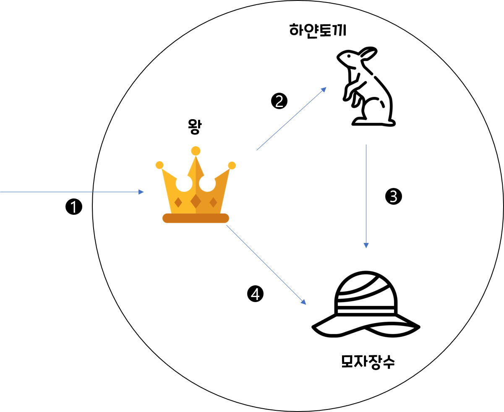
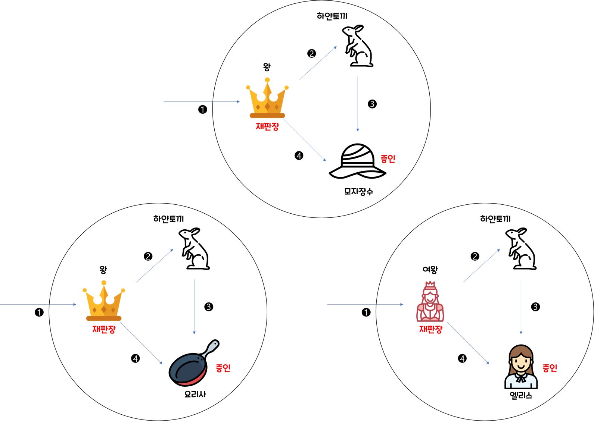

# 책의 리뷰📔
> part : 4장  
> chapter : 역할, 책임, 협력  
> CreateDate : 2022.06.01  
> UpdateDate :    
 
## 역할, 책임, 협력  
 - 객체의 세계에서는 객체가 가져야할 상태와 행동뿐만 아니라 협력도 매우 중요한 고려사항이다.
 - 결국, 객체지향 설계의 품질은 역할, 책임, 협력에 의해 결정된다.

### 협력의 예시
 - 요청하고 응답하며 협력
 - 이상한 나라의 엘리스 재판 모습
  

 

 
 - 왕, 하얀토끼, 모자 장수가 등장하고, 서로 재판이라는 목적을 가지고 협력한다.
 
### 책임
  - 위에서 왕은 재판을 수행하라는 요청에 의해 재판을 수행할 책임을 지게된다.
    - 즉, 협력하는 객체라면 요청을 처리할 책임이 있다. 
  - 객체의 책임은 2가지로 나눌 수 있다. 
    - 무엇을 알고 있는가(Knowing)
    - 무엇을 할 수 있는가(doing)   
  - 일반적으로 책임은 외부에서 접근 가능한 고용 서비스 관점이기에 객체의 **공용 인터페이스**를 구성한다.
  - 주의할 점은 책임과 메시지의 수준이 같지는 않다는 점이다. 책임은 객체가 협력에 참여하기위해 수행해야하는 행위를 상위 수준에서 개략적으로 서술한 것(인터페이스)

### 역할
 - 협력안에서 책임을 가진다는 것은 역할을 수행한다는 뜻이다.
 - 위에서 왕은 판사의 역할을 가지고, 모자장수는 증인이라는 역할을 가진다.
 - 그럼 왜 굳이 왕에 판사역할을, 모자장수에 증인 역할을 넣어 복잡하게 만드는 것일까?
 - 역할은 재사용 가능하고 유연한 객체지향 설계를 낳는 매우 중요한 구성요소기 때문이다. 
 - 역할을 추상화함으로써, 협력에 참여할 수 있는 객체를 어느 한가지로 제한할 필요가 없어진다.

 

> 즉, 역할은 객체지향 설계의 단순성, 유연성, 재사용성을 뒷받침하는 핵심 개념이다.

  

## 애플리케이션 객체 지향 설계 기법 3가지👁‍🗨

### 1. 책임-주도-설계 
 - 현재 가장 널리 쓰이는 객체지향 설계 방법은 `레베카 워프스브록`이 고안한 **책임-주도 설계 방법**이다.
   - 말 그대로 객체의 책임을 중심으로 시스템을 구축한다. 
 - 4장에서 언급했던 이야기 "역할, 책임, 협력"을 고안하는 방법이 책임-주도-설계 방법
   - 작은 규모의 책임을 가지는 객체로 분할되고, 스스로 처리할 수 없는 정보가 기능이 필요하면, 다른 객체에게 요청하는 방식 
 - 결국 협조적이면 성실한 사람들의 모임이 되었다고 볼 수 있다.

### 2. 디자인패턴
  - 책임-주도 설계의 결과를 표현, 즉 이미 만들어진 키트와 같은 것이어서, 작업을 할 때, 적절하게 가져와 쓸 수 있다.
  - 대표적인 [GOF의 `디자인 패턴`]이라는 책에 나온 23가지 디자인 패턴이 있다.
### 3. 테스트 주도 개발(TDD)
 - 책임-주도 -설계를 통해 도달해야 하는 목적지를 테스트 주도 개발을 통해 견고한 방법으로 갈수 있는 안전장치와 같다.
 - 객체가 이미 존재한다고 가정하고 객체에게 어떤 메시지를 메시지를 전송할 것인가에 대해 생각한다. 
  -  **하지만 이와 같은 경우 잘못된 접근 방법이다??**(나는 이 위와 같이 했었던것 같다.)
 - 책임을 수행할 객체 또는 클라이언트가 기대하는 객체의 역할이 메시지를 수신할 때, 어떤 결과를 반환하고 그 과정에서 어떤 객체와 협력할 것인지에 대한 기대를 작성

### 결론 
> 책임-주도-설계 -> 디자인 패턴 -> 테스트주도개발
 - 그래서 먼저 책임-주도-설계의 기본 개념을 알아야하고 그러다 보면 디자인패턴의 원리나, 종합적으로 이해가 가면서, 좋은 설계가 무엇인지 감각과 경험을 기를 수 있고, 그다음으로 테스트 주도개발을 보다 깊이 있는 고민을 통해 제대로 활용할 수 있다.
 - 그니까 이전것들을 마스터해야, 다음걸 배울 수 있기 보다는, 이전 단계를 마스터해야 100% 활용도를 높일 수 있다는 이야기

  

## 아쉬웠던 곳 😥

### 경제학 게임
 - 한명은 금액을 나누자고 제안하는 사람, 다른 한명은 응답하는 사람이다.(제안은 번복할 수 없고, 거절 할 시 둘다 못 갖는다.)
 - 제안자는 본인의 비율이 클수록 좋은 거고, 응답자는 무엇이 되든 받을 수 없는 것보다 받는 게 이득이다.
     - 개인적으로  제안하는 사람과 응답하는 사람이 동등한 계급(?)일때 가능하다고 본다. 
     - 왜냐하면, 대기업과 중소기업의 관계에서는 성립하지 못하는 이야기이다. 
 - 하지만, 실세계와 컴퓨터 프로그래밍 세계는 모방이 아니기에, 비유 적용은 가능해보인다. 
  

## 느낀점 😌
 - 가장먼저 드는 생각, 나는 책임-주도-설계로 코드를 짜본적이 있는 가??? 부터 접근을 하면서 매번 코드를 짜야겠다. 
 - 그리고, 더 나아가 디자인패턴을 알게되고 , 테스트주도개발 또한 익숙해질때 쯤 다시 한번 책을 펴볼 것 같다. 

  

## 그밖의 내용🎈
 - COMPOSITE 패턴
 - 그럼 5장에서는 객체 지향이 다른 패러다임에 비해 강력한 이유는 책임과 메시지에 숨겨져있다
